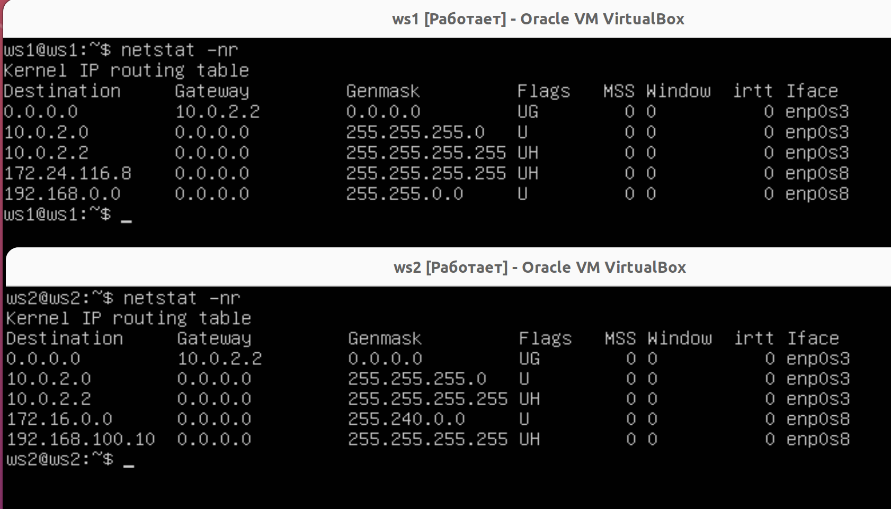
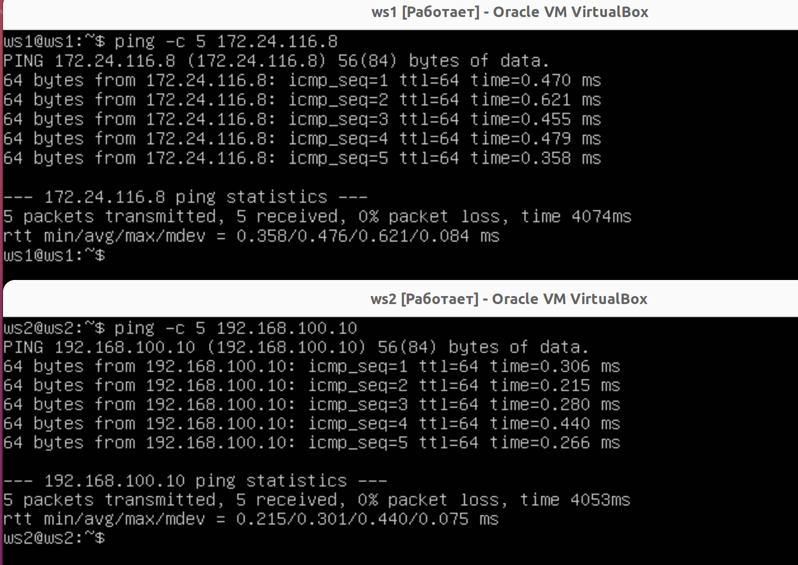
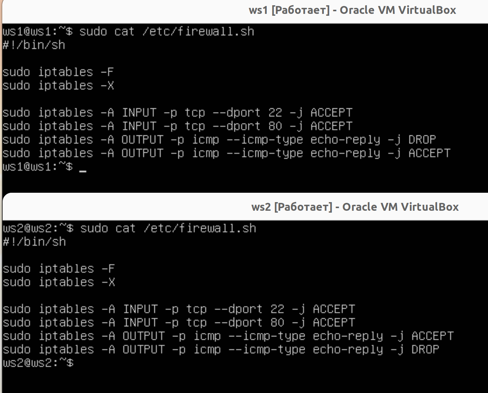
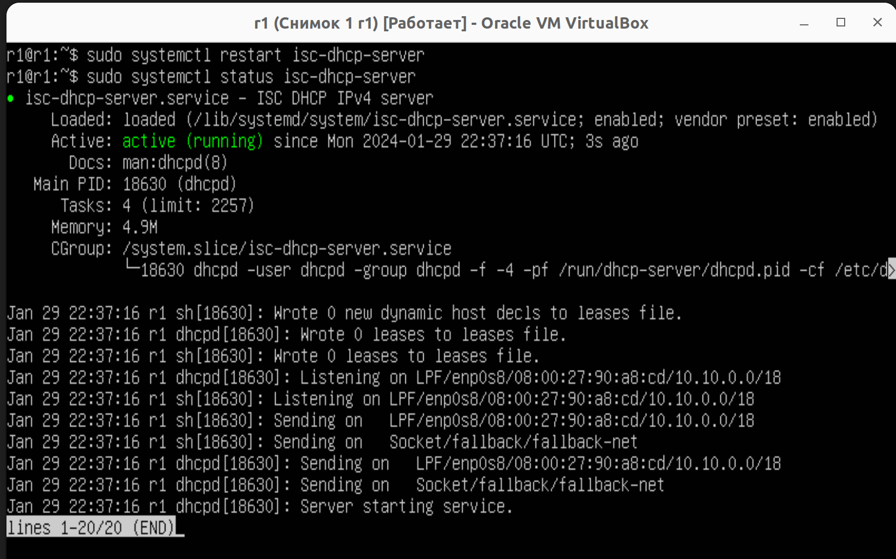
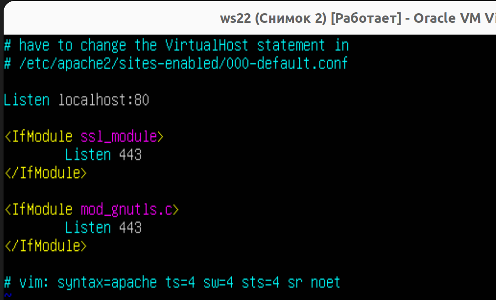

# Сети в Linux - ОТЧЁТ

## Part 1. Инструмент **ipcalc**

**== Задание ==**

##### Поднять виртуальную машину (далее -- ws1)

#### 1.1. Сети и маски
##### Определить и записать в отчёт:
##### 1) Адрес сети *192.167.38.54/13*


##### 2) Перевод маски *255.255.255.0* в префиксную и двоичную запись, */15* в обычную и двоичную, *11111111.11111111.11111111.11110000* в обычную и префиксную

1. маска 255.255.255.0 в префиксной - /24
2. маска 255.255.255.0 в двоичной - 11111111.11111111.11111111.00000000
3. /15 в обычную - 255.254.0.0.
4. /15 в двоичную - 11111111.11111110.00000000.00000000
5. 11111111.11111111.11111111.11110000 в обычную - 255.255.255.240
6. 11111111.11111111.11111111.11110000 в префиксную - /28

##### 3) Минимальный и максимальный хост в сети *12.167.38.4* при масках: */8*, *11111111.11111111.00000000.00000000*, *255.255.254.0* и */4*


>Минимальный и максимальный хост в сети *12.167.38.4* при масках: */8*


>Минимальный и максимальный хост в сети *12.167.38.4* при масках: *11111111.11111111.00000000.00000000*


>Минимальный и максимальный хост в сети *12.167.38.4* при масках: *255.255.254.0*


>Минимальный и максимальный хост в сети *12.167.38.4* при масках: /4

#### 1.2. localhost
##### Определить и записать в отчёт, можно ли обратиться к приложению, работающему на localhost, со следующими IP: *194.34.23.100*, *127.0.0.2*, *127.1.0.1*, *128.0.0.1*


> 194.34.23.100 - нельзя


> 127.0.0.2 - можно


> 127.1.0.1 - можно


128.0.0.1 - нельзя

#### 1.3. Диапазоны и сегменты сетей
##### Определи и запиши в отчёт:
##### 1) Какие из перечисленных IP можно использовать в качестве публичного, а какие только в качестве частных: *10.0.0.45*, *134.43.0.2*, *192.168.4.2*, *, *172.0.2.1*, *192.172.0.1*, *172.68.0.2*, *172.16.255.255*, *10.10.10.10*, *192.169.168.1*


> Private


> Private


> Public


> Public


> Private


> Public


> Private


> Public


> Public

2) Какие из перечисленных IP адресов шлюза возможны у сети 10.10.0.0/18: 10.0.0.1, 10.10.0.2, 10.10.10.10, 10.10.100.1, 10.10.1.255


>     10.0.0.1 - нет
>     10.10.0.2 - да
>     10.10.10.10 - да
>     10.10.100.1 - нет
>     10.10.1.255 - да (шировещательный)


## Part 2. Статическая маршрутизация между двумя машинами

**== Задание ==**

##### Поднять две виртуальные машины (далее -- ws1 и ws2)

##### С помощью команды `ip a` посмотреть существующие сетевые интерфейсысд

> отчет по машинам ws1 и ws2 по команде "ip a"


##### Опиши сетевой интерфейс, соответствующий внутренней сети, на обеих машинах и задать следующие адреса и маски: ws1 - *192.168.100.10*, маска */16*, ws2 - *172.24.116.8*, маска */12*


> выполним команды `netplan apply` и `netplan try` для перезапуска сервиса сетивыполним команды `netplan apply` и `netplan try` для перезапуска сервиса сети


### 2.1. Добавление статического маршрута вручную

 Добавим статический маршрут от одной машины до другой и обратно при помощи команды `ip route add`

  * Добавляем статический маршрут с помощью команды `ip r add [ip-адрес] dev enp0s8` \
    Вызывваем `netstat -nr`, чтобы проверить, что маршрут действительно задан.

    

* Пропинговать соединение между машинами
    * Проверяем подключение с помощью команды `ping -c 5 [ip-адрес]` \
    
    * 0 % packet loss - успешно

### 2.2. Добавление статического маршрута с сохранением

* Перезапускаем машины и видим, что наши маршруты не сохранились
  `netstat -nr`
  

* Добавляем статический маршрут от одной машины до другой с помощью файла `etc/netplan/00-installer-config.yaml`
  Добавляем строчку `routes` и прописываем маршурты. В строке `to` задаем адрес, до которого необходим маршрут, в строке `via` - адрес шлюза

  

* Пингуем машины для проверки подключения
      

## Part 3. Утилита iperf3

### 3.1. Скорость соединения

- 8 Mbps = 1 MB/s
- 100 MB/s = 800000 Kbps
- 1 Gbps = 1024 Mbps  
(bps - бит в секунду, B/s - байт в секунду)

### 3.2. Утилита iperf3
* Утилита `iperf` - это генератор сетевого трафика, предназначенный для проверки скорости и пропускной способности сети.  Она поддерживает работу как по протоколу TCP, так и по UDP. Для проведения тестирования надо запустить iperf3 как на сервере, так и на клиенте. Клиентская часть будет генерировать трафик, а серверная - принимать и отбрасывать.

- Устанавливаем утилиту `sudo apt install iperf3`
- На одной машине запускаем iperf3 в режиме сервера: `iperf3 -s`.  
Сервер по дефолту начнет слушать порт 5021
- На второй машине запускаем iperf3 в клиенстком режиме: `iperf3 -c [адрес сервера]`

* Утилита будет инициировать сетевое соединение на указанный адрес хоста (домен либо IP) через порт 5021. Будет начато тестирование. На протяжении 10 секунд между этими хостами будет идти обмен трафиком, после чего соединение будет завершено и будет выведена информация с результатами теста.

* Серверная версия на первой машине (ws1): `iperf3 -s` \

    
* Клиентская версия на второй машине (ws2): `iperf3 -c 192.168.100.10`\


## Part 4. Сетевой экран

### 4.1. Утилита iptables

- Создаем файл /etc/firewall.sh, имитирующий фаерволл, на ws1 и ws2: `sudo touch /etc/firewall.sh`

- Открываем файлы для редактирования и добавления туда правил: `sudo nano /etc/firewall.sh`. Добавляем команды для очищения всех правил (`iptables -F`) и удаления цепочки (`iptables -X`)

- Добавляем в файл `/etc/firewall.sh` правила:
    - открыть на машинах доступ для порта 22 (ssh) и порта 80 (http)
    - на первой машине: запрещаем и разрешаем echo-reply
    - на второй машине: разрешаем и запрещаем echo-reply
    - В итоге файлы выглядят так: \
    
  
- Запустить файлы на обеих машинах командами и пингануть для проверки: 
    * `sudo chmod +x /etc/firewall.sh`
    * `/etc/firewall.sh`

    
    
    > В случ. возникновения протеворечивых правил (как в нашем случае сервер > клиент и клиент > сервер) работает правило наступившее ранее, т.е. которое стоит выше строчкой - сервер пингует клиент, а клиент не может в ответ сервер!

### 4.2. Утилита **nmap**

Nmap (“Network Mapper”) это утилита с открытым исходным кодом для исследования сети и проверки безопасности. Инструмент Nmap предназначен прежде всего для сканирования сети и аудита безопасности.

* Проверяем, работают ли установленные нами правила, - пингуем машины.


- Проверяем, что при этом хост запущен
    - `nmap 172.24.116.8` и `nmap 196.168.100.10`
  
      

    "Host is up" есть - значит, хост работает.

- Сохранить дампы образов виртуальных машин
    - Выбираем Снимки -> Сделать, задаем имя для снимка.
    

## Part 5. Статическая маршрутизация сети

### 5.1. Настройка адресов машин

Настроить конфигурации машин в etc/netplan/00-installer-config.yaml согласно сети на рисунке ниже.


В отчёт поместить скрины с содержанием файла etc/netplan/00-installer-config.yaml для каждой машины.

> Важно принять настройки командой "sudo netplan apply", иначе комада "ip a..." не покажет вновь выставленные айпи адреса в конфигах

 > Машина - r1:
 
 
 > Машина - ws11:
 

 > Машина - r2:
 

 > Машина - ws21:
 

 > Машина - ws22:
 

 > Взаимно пингуем машины r1 и ws11
 

 > Взаимно пингуем машины ws22 и ws21
 

 Машины пингуются, сеть настроено правильно.

### 5.2. Включение переадресации IP-адресов.
##### Для включения переадресации IP, выполним команду на роутерах:
`sysctl -w net.ipv4.ip_forward=1`

> (При таком подходе переадресация не будет работать после перезагрузки системы)


---

> Для включения IP-переадресации на постоянной основе необходимо в конфиг файл */etc/sysctl.conf* добавить следующую строку:
`net.ipv4.ip_forward = 1` согласно скринам ниже:

  

* Данная строка по умолчанию прописана в конфиге, необходимо раскоментировать указанную строку

#### 5.3. Установка маршрута по-умолчанию

> Настроить маршрут по-умолчанию (шлюз) для рабочих станций. Для этого снова будем редактировать файл конфигурации сети sudo nano etc/netplan/00-installer-config.yaml. Раньше для настройки адреса шлюза использовали директиву gateway4, но теперь она считается устаревшей и вместо нее используется routes со значениями to: default и via: [адрес шлюза]

* машина WS11


* машина WS21


* машина WS22


> Пропинговать с ws11 роутер r2 и показать на r2, что пинг доходит. Для этого использовать команду:\
`tcpdump -tn -i eth1` (в нашем случае сетевой интерфейс enp0s8)


#### 5.4. Добавление статических маршрутов

##### Добавить в роутеры r1 и r2 статические маршруты в файле конфигураций. Пример для r1 маршрута в сетку 10.20.0.0/26:
```shell
# Добавить в конец описания сетевого интерфейса eth1:
- to: 10.20.0.0
  via: 10.100.0.12
```


Вызвать ip r и показать таблицы с маршрутами на обоих роутерах. Пример таблицы на r1:
```
10.100.0.0/16 dev eth1 proto kernel scope link src 10.100.0.11
10.20.0.0/26 via 10.100.0.12 dev eth1
10.10.0.0/18 dev eth0 proto kernel scope link src 10.10.0.1
```


> Запустить команды на ws11:\
`ip r list 10.10.0.0/[маска сети] и ip r list 0.0.0.0/0`


> В отчёте объяснить, почему для адреса 10.10.0.0/[маска сети] был выбран маршрут, отличный от 0.0.0.0/0, хотя он попадает под маршрут по-умолчанию.

Маршрут по умолчанию не был выбран т.к. существует более точный маршрут описанный нами в конфигурации. Выбор маршрута возможно изменить с помощью установки более высокого приоритета для него.

#### 5.5. Построение списка маршрутизаторов
Пример вывода утилиты **traceroute** после добавления шлюза:
```
1 10.10.0.1 0 ms 1 ms 0 ms
2 10.100.0.12 1 ms 0 ms 1 ms
3 10.20.0.10 12 ms 1 ms 3 ms
```
##### Запусти на r1 команду дампа:
`tcpdump -tnv -i eth0`


##### При помощи утилиты **traceroute** построй список маршрутизаторов на пути от ws11 до ws21
- В отчёт помести скрины с вызовом и выводом использованных команд (tcpdump и traceroute).
- В отчёте, опираясь на вывод, полученный из дампа на r1, объясни принцип работы построения пути при помощи **traceroute**.


<b>Принцип работы построения пути при помощи traceroute</b>  
    Каждый пакет проходит на своем пути определенное количество узлов, пока достигнет своей цели. Причем, каждый пакет имеет свое время жизни. Это количество узлов, которые может пройти пакет перед тем, как он будет уничтожен. Этот параметр записывается в заголовке TTL, каждый маршрутизатор, через который будет проходить пакет уменьшает его на единицу. При TTL=0 пакет уничтожается, а отправителю отсылается сообщение Time Exceeded.

    Команда traceroute linux использует UDP пакеты. Она отправляет пакет с TTL=1 и смотрит адрес ответившего узла, дальше TTL=2, TTL=3 и так пока не достигнет цели. Каждый раз отправляется по три пакета и для каждого из них измеряется время прохождения. Пакет отправляется на случайный порт, который, скорее всего, не занят. Когда утилита traceroute получает сообщение от целевого узла о том, что порт недоступен трассировка считается завершенной.

#### 5.6. Использование протокола ICMP при маршрутизации

> Запустить на r1 перехват сетевого трафика, проходящего через eth0 с помощью команды:\
`tcpdump -n -i eth0 icmp`

> Пропинговать с ws11 несуществующий IP (например, 10.30.0.111) с помощью команды:\
`ping 10.30.0.111`


##### Сохраним дампы образов виртуальных машин (машина -> снимок)

## Part 6. Динамическая настройка IP с помощью **DHCP**

`-` Следующим нашим шагом будет более подробное знакомство со службой **DHCP**, которую ты уже знаешь.

**== Задание ==**

*В данном задании используются виртуальные машины из Части 5*

##### Для r2 настрой в файле */etc/dhcp/dhcpd.conf* конфигурацию службы **DHCP**:
##### 1) Укажи адрес маршрутизатора по-умолчанию, DNS-сервер и адрес внутренней сети. Пример файла для r2:
```shell
subnet 10.100.0.0 netmask 255.255.0.0 {}

subnet 10.20.0.0 netmask 255.255.255.192
{
    range 10.20.0.2 10.20.0.50;
    option routers 10.20.0.1;
    option domain-name-servers 10.20.0.1;
}
```

 > Для начала на машине r2 проверим наличие установленной службы DHCP-сервера.
 Обновим пакеты update/upgrade и далее накатим "sudo apt-get install isc-dhcp-server"

> Для корректной работы DHCP сервера (автомтизированная раздача адресов хостам в своей подсети т.е. из какой сети будет принимать запросы DHCP-discover/DHCP-request. Выставим название сетевого интерфейса для его внутренней сети) необходимо правка файла по следующему пути: /etc/default/isc-dhcp-server.


 > Следом корректируем файл по пути /etc/dhcp/dhcpd.conf 

  

 > Важно снять комментарий со строки "autohoritative" - для верной раздачи IP адресов в своей подсети автоматически

 * subnet 10.100.0.0 netmask 255.255.0.0 {} - оставляем пустым, т.к. в данной сети наша машина не будет радавать IP адреса, в свою очередь является просто шлюзом с заранее выданным статическим адресом.

 * subnet 10.20.0.0 netmask 255.255.255.192 - заполняем спеки, т.к. в данной сети машина будет в роли DHCP-сервера
 {
    range 10.20.0.2 10.20.0.50; - устанавливаем верхнюю и нижнюю планки для автоматического присовения адресов. Важно, что б данный показатели входил в интервал в HostMin - HostMax.

    option routers 10.20.0.1; - устанавливаем шлюз по умолчанию для хостов в подсети данной машины

    option domain-name-servers 10.20.0.1; - устанавлиеваем DNS-сервер для хостов в подсети данной машины
}


##### 2) В файле *resolv.conf* пропиши `nameserver 8.8.8.8`.

  

##### Перезагрузи службу **DHCP** командой `systemctl restart isc-dhcp-server`. 


Машину ws21 перезагрузи при помощи `reboot` и через `ip a` покажи, что она получила адрес. 


 * Адрес DHCP-серверов присвоен. Логи по машине r2 демонстрируют все 4 этапа работы службы "isc-dhcp-server". Логи выводим командой: sudo tail -f /var/log/syslog


Также пропингуй ws22 с ws21.


##### Укажи MAC адрес у ws11, для этого в *etc/netplan/00-installer-config.yaml* надо добавить строки: `macaddress: 10:10:10:10:10:BA`, `dhcp4: true`

> Важно выставить настройки МАС адреса в настройках VirtualBox


> Далее корректируем конфиг в машине


##### Для r1 настрой аналогично r2, но сделай выдачу адресов с жесткой привязкой к MAC-адресу (ws11). Проведи аналогичные тесты

> необходимо правка файла по следующему пути: /etc/default/isc-dhcp-server.


> Следом корректируем файл по пути /etc/dhcp/dhcpd.con


## ⚠️ ВАЖНО! 

* Фиксированный адрес по МАС прописать за пределами интервала "range"!
В противном случае это может привести к ошибкам когда какое-то другое устройство подключается к сети, когда ws11 отключено, DHCP сервер может назначить этому устройству IP-адрес из интервала "range" (поскольку он доступен в пуле динамических адресов). Когда позже ws11 пытается подключиться, возникает конфликт, так как оба устройства пытаются использовать один и тот же IP-адрес.

> С файлом `/etc/resolv.conf` делаем все то же что и в в прошлый раз - добавляем DNS-сервер 8.8.8.8


> Далее запустим службу DHCP и проверим статус



> Настройки хоста ws11: 


##### Запроси с ws21 обновление ip адреса

* Запрос нового айпи от сервера благодря команде dhclient enp0s8 


##### Сохрани дампы образов виртуальных машин

## Part 7. **NAT** (механизм преобразования адресов).

**== Задание ==**

- Устанавливаем Apache на r1 и ws22 командой `sudo apt install apache2`

- В файле etc/apache2/ports.conf (на двух машинах) меняем строку `Listen 80` на `Listen 0.0.0.0:80`, то есть делаем сервер Apache2 общедоступным

 

 ##### Запусткаем веб-сервер Apache командой `service apache2 start` на ws22 и r1

 

##### Добавить фаервол, созданный по аналогии с фаерволом из Части 4, на r2 следующие правила:


##### 1) Удаление правил в таблице filter - `iptables -F`
##### 2) Удаление правил в таблице "NAT" - `iptables -F -t nat`
##### 3) Отбрасывать все маршрутизируемые пакеты - `iptables --policy FORWARD DROP`


* файл необходимо  создать по адресу /etc/firewall.sh

> Проверим пинг от машины r1 до ws22... пинг есть, т.к. правило фаервола не запущено

  

> Пинганем так же после запуска скрипта файрволла на машине r2: 
  
  

  * пинга нет от машины r1 в подсеть машины r2, т.к. поток FORWARD выставлен в DROP.

> Добавить в файл ещё одно правило:
разрешить маршрутизацию (т.е. FORWARD) всех пакетов протокола ICMP


> Проверить соединение между ws22 и r1 командой ping


> Добавить в файл ещё два правила:

5) включить **SNAT**, а именно маскирование всех локальных ip из локальной сети, находящейся за r2 (по обозначениям из Части 5 - сеть 10.20.0.0)
6) включить DNAT на 8080 порт машины r2 и добавить к веб-серверу Apache, запущенному на ws22, доступ извне сети


> Проверить соединение по TCP для SNAT, для этого с ws22 подключиться к серверу Apache на r1 командой:


> Проверить соединение по TCP для DNAT, для этого с r1 подключиться к серверу Apache на ws22 командой telnet (обращаться по адресу r2 и порту 8080)


## Part 8. Дополнительно. Знакомство с **SSH Tunnels**

> Запустить на r2 фаервол с правилами из Части 7


> Запустить веб-сервер Apache на ws22 только на localhost (то есть в файле /etc/apache2/ports.conf изменить строку Listen 80 на Listen localhost:80)



> Воспользоваться Local TCP forwarding с ws21 до ws22, чтобы получить доступ к веб-серверу на ws22 с ws21


> Воспользоваться Remote TCP forwarding c ws11 до ws22, чтобы получить доступ к веб-серверу на ws22 с ws11

